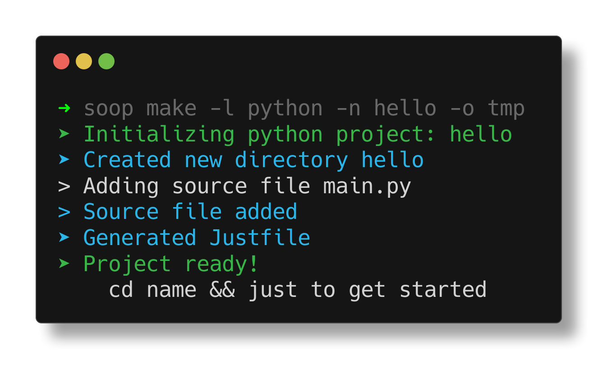
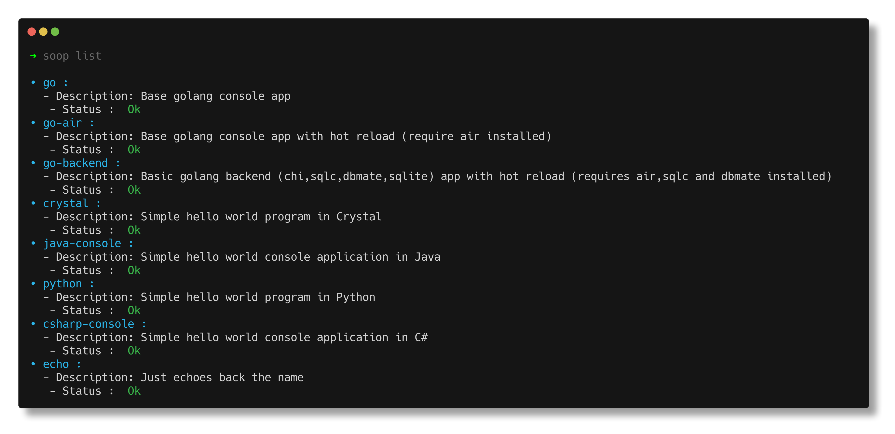

# SOOP - Simple Project Scaffolding

SOOP is a versatile command-line tool written in Crystal that helps initialize projects for various programming languages. It streamlines the process of setting up new projects with default configurations and provides a unified interface for running projects across different languages.

## Features

- Initialize new projects for multiple programming languages
- Generate Just files for languages without built-in runners
- Support for custom project templates
- Easy-to-use command-line interface

## Installation

Ensure you have `crystal` and `Just` installed on your system. Then, clone this repository and build the project:

```bash
git clone https://github.com/yourusername/soop.git
cd soop
shards install
just build
```
You can also add run this command to install it in a "tools" directory
```shell
just install-tool <path/to/your/tools>
```
## Usage
### make
To generate a new project, run the compiled binary with the following options:
```shel
./soop make -l <language> -n <project_name>
```
Options:
- -l, --language: The programming language for the project (default: crystal)
- -n, --name: The name of the project (required)
- -o, --output: The output directory of the project or the current working directory if not set

Examples:
```shell
soop make -l python -n hello -o tmp
```

### list
Will list all available templates and their status


## Configuration

Soop uses a YAML configuration file to define language-specific settings.The  location of the configuration file is `$HOME/.config/soop/config.yml`. 
The default configuration is as follows:
```yaml
go:
  command: >-
    go mod init {name} &&
    go get github.com/go-chi/chi/v5 &&
    go get github.com/mattn/go-sqlite3 &&
    air init
  description: "Basic golang backend (chi, sqlc, dbmate, sqlite) app with hot reload (requires air, sqlc and dbmate installed)"
  check: "go air dbmate sqlc"
  mkdir: true
  justfile_path: "templates/go-air.justfile"

crystal:
  command: >-
    crystal init app {name}
  description: "Simple hello world program in Crystal"
  check: "crystal"
  mkdir: false
  justfile_path: "templates/crystal.justfile"

java-console:
  command: >-
    mvn archetype:generate -DgroupId=com.{name}.app -DartifactId={name}
    -DarchetypeArtifactId=maven-archetype-quickstart -DarchetypeVersion=1.5
    -DinteractiveMode=false
  description: "Simple hello world console application in Java"
  check: "mvn"
  justfile_path: "templates/java.justfile"

python:
  sources:
    "main.py": "templates/python/main.py"
  description: "Simple hello world program in Python"
  check: "python3"
  justfile_path: "templates/python.justfile"

csharp-console:
  command: >-
    dotnet new console -o {name} --use-program-main
  description: "Simple hello world console application in C#"
  check: "dotnet"

echo:
  command: >-
    echo {name}
  description: "Just echoes back the name"
  check: "echo"
```

To define a new templates you just have to add it to your configs
```yaml
my-language:
  sources:
    "main.lang":"templates/lang/main.lang"
    ...
```

|Key |Type  |Description | Example |
|----|------|------------|---------|
|command|string|The initialization command  | "go mod init {name} && air init ." |
|description|string|A brief description of the language setup|"Basic Go project with air setup"|
|check|string|Command(s) to check if language tools are installed| - |
|mkdir|boolean|Whether to create a directory for the project| true or false |
|justfile_path|string|Path to a template Justfile for the language|"templates/go.justfile"|
|dockerfile_path|string|Path to a template Dockerfile for the language|"templates/go.dockerfile"|
|sources|string[]|Path to a template file for the language| - |

- `{name}` is will be replaced by the project's name.

## Contributing

1. Fork it (<https://github.com/lakubudavid/soop.cr/fork>)
2. Create your feature branch (`git checkout -b my-new-feature`)
3. Commit your changes (`git commit -am 'Add some feature'`)
4. Push to the branch (`git push origin my-new-feature`)
5. Create a new Pull Request

## Contributors

- [lakubuDavid](https://github.com/your-github-user) - creator and maintainer
